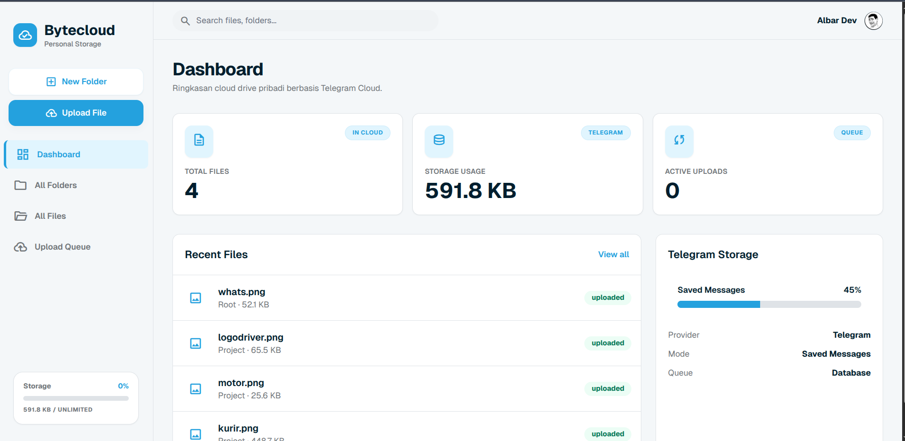

# Bytecloud



Bytecloud is a lightweight personal cloud storage application that uses Telegram as its storage backend. By leveraging the Telegram API (Saved Messages), you can enjoy "unlimited" storage for your personal files.

## Key Features

- **Unlimited Storage**: Powered by Telegram Cloud infrastructure.
- **File & Folder Management**: Organize your files in a clean, hierarchical folder structure.
- **Real-time Upload Progress**: Monitor your file transfers with live progress bars.
- **Instant Media Preview**: View images, videos, and PDF documents directly in the browser via an elegant lightbox.
- **Background Upload Queue**: Reliable file transfers handled by background workers to keep the UI responsive.

## Tech Stack

- **Backend**: Laravel 11
- **Telegram Engine**: [MadelineProto](https://docs.madelineproto.xyz/)
- **Frontend**: Tailwind CSS & Alpine.js
- **Database**: MySQL / SQLite

## System Requirements

- PHP 8.2 or higher
- PHP Extensions: `mbstring`, `xml`, `json`, `fileinfo`, `gd`, `openssl`
- Database (MySQL/PostgreSQL/SQLite)
- Telegram API ID & API Hash (Obtain yours at [my.telegram.org](https://my.telegram.org))

## Installation

1. **Clone the repository**
   ```bash
   git clone https://github.com/yourusername/bytecloud.git
   cd bytecloud
   ```

2. **Install dependencies**
   ```bash
   composer install
   npm install && npm run build
   ```

3. **Configure Environment**
   Copy the `.env.example` file to `.env` and adjust the settings:
   ```bash
   cp .env.example .env
   ```
   Configure your Telegram API credentials:
   ```env
   TELEGRAM_API_ID=your_api_id
   TELEGRAM_API_HASH=your_api_hash
   ```

4. **Setup Database**
   ```bash
   php artisan migrate
   ```

5. **Run the Queue Worker (Critical)**
   The application uses queues for file uploads. Ensure the worker is running:
   ```bash
   php artisan queue:work
   ```

6. **Start the Application**
   ```bash
   php artisan serve
   ```
   Open `localhost:8000` in your browser and follow the Telegram login steps (QR Scan or Phone Code).

## Security Note

Telegram session data is stored locally in the `storage/app/telegram-sessions` directory. **Never share the contents of this folder** as it contains full access to your connected Telegram account.

## License

[MIT License](LICENSE)
